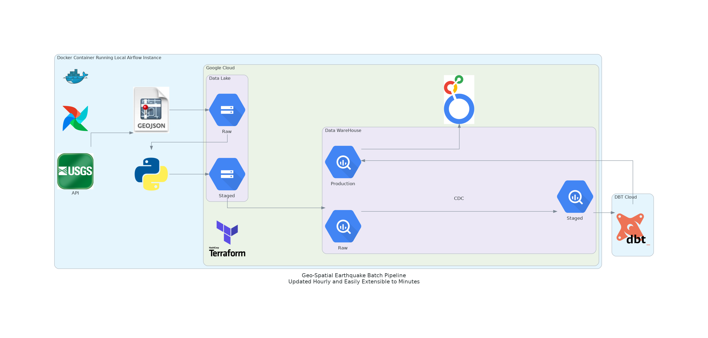

# Architecture Diagram

# System requirements

- You will need Docker, Docker Compose, Terraform and an account with Google Cloud Services, an accompaning project with a credentials file (detailed below).  
- Built on Linux OS
- You will need to place a .env file in the home directory with the following variables.
    -  GCP_PROJECT_ID
    -  GCP_GCS_BUCKET
    -  AIRFLOW_UID
    -  POSTGRES_USER
    -  POSTGRES_PASSWORD
    -  POSTGRES_DB
    -  GOOGLE_APPLICATION_CREDENTIALS
- The project requires a credentials file in the following directory  ~/.google/credentials/. 
- The GOOGLE_APPLICATION_CREDENTIALS is the path to the credentials file for your Google Cloud Services Project. Mine is ~/.google/credentials/gcs_credentials_usgs_equake.json

# Overview

- This project ingests geospacial earthquake event data hourly from the [USGS API](https://earthquake.usgs.gov/earthquakes/feed/v1.0/summary/all_hour.geojson).
- The purpose of the project was to utilize skillset gained from participating in (self-paced mode) [The Data Engineering Zoomcamp](https://github.com/DataTalksClub/data-engineering-zoomcamp)
- The zoomcamp exposed me to new technologies I am unable to utilize because of the constraints of working in the governemnt.
- I challenged myself by choosing a geospatial dataset to load into Big Query, as well as creating an architecture that leverages CDC and is scalable to a refresh time in minutes.
- The pipeline runs on an hourly schedule, whereas the data engineering zoomcamp utilizes a one-time load of the data.

# DBT Repo
- [repository housing DBT Cloud connected to Google Big Query](https://github.com/tleedepriest/dbt-usgs-gcs-batch-pipeline)

# TODO
- create makefile with convienence commands
- build out models in DBT cloud for more in depth analysis (currently simply renames columns and creates a primary key/dedeuplicates events based on most recent occurence).
- Deploy pipeline to VM instance in the cloud, and expose Airflow UI to public ports.

